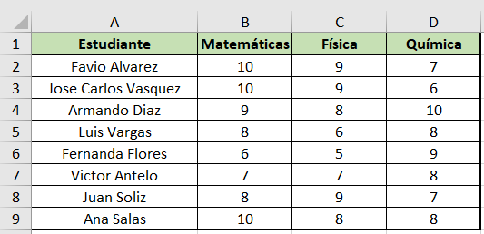

# APLICACIÓN PARA LEER Y GENERAR DOCUMENTOS

### El proyecto consiste en la creación de una aplicación realizada con lenguaje python y sirve para la lectura de datos de un documento excel y la generación de documentos word a traves de una plantilla personalizada.

## PRIMER PASO: Archivo Excel

### Primero se crea un archivo excel con los datos que se quieren leer o se abre un archivo ya elaborado, la hoja de excel para la aplicación creada debe tener los datos ordenados en columnas, como en la siguiente imágen: 
## GENERACIÓN DE GRÁFICAS CON PYTHON 

Gráfico1 pastel 

Gráfico2 Barras

Gráfico2 pastel 

Gráfico3 Barras

Gráfico3 pastel 

Gráfico4 Barras

Gráfico4 pastel 

Gráfico5 Barras

Gráfico5 pastel 

Gráfico ejemplo Barras

Gráfico ejemplo pastel 

