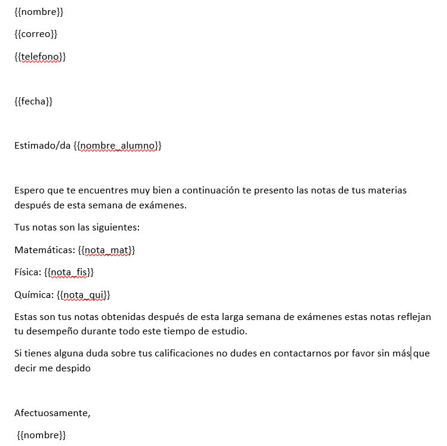
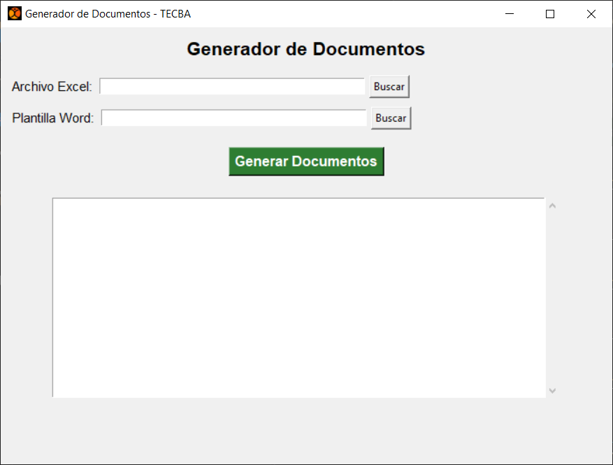
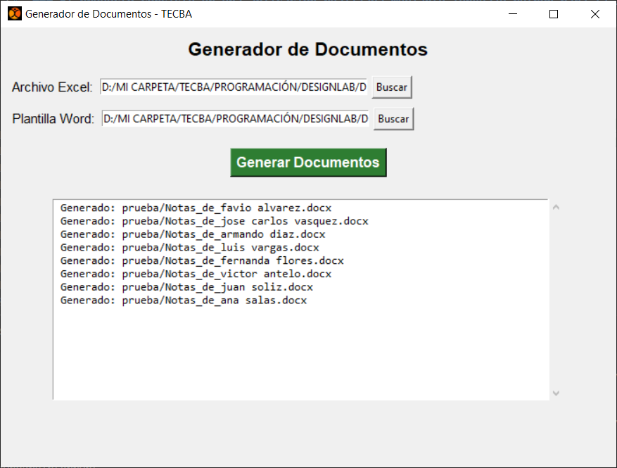

# APLICACIÓN PARA LEER Y GENERAR DOCUMENTOS

### El proyecto consiste en la creación de una aplicación realizada con lenguaje python y sirve para la lectura de datos de un documento excel y la generación de documentos word a traves de una plantilla personalizada.

## PRIMER PASO: Archivo Excel
### Primero se crea un archivo excel con los datos que se quieren leer o se abre un archivo ya elaborado, la hoja de excel para la aplicación creada debe tener los datos ordenados en columnas, como en la siguiente imágen: 


## SEGUNDO PASO: Archivo Word
### Crear un archivo word que contengan como variables los nombres de los títulos de cada columna del archivo excel, como en la siguiente imágen:



## TERCER PASO: Entorno virtual
### En visual studio code crear un entorno virtual de nombre venv, con el siguiente comando:
   ```bash
   npm python -m venv venv
   ```
### Activar el entorno virtual, con el siguiente comando:
   ```bash
   npm venv\Scripts\activate
   ```

## CUARTO PASO: Instalar librerías
### Crear un archivo requirements.txt con las librerías a instalar, escribir el siguiente comando:
   ```bash
   pip install -r requirements.txt
   ```
## QUINTO PASO: Crear un script 
### Crear un script con el nombre app.py para crear la aplicación, el resultado esperado es el siguiente:


### Subir los archivos de excel y word para generar los documentos, como se muestra a continuación:



